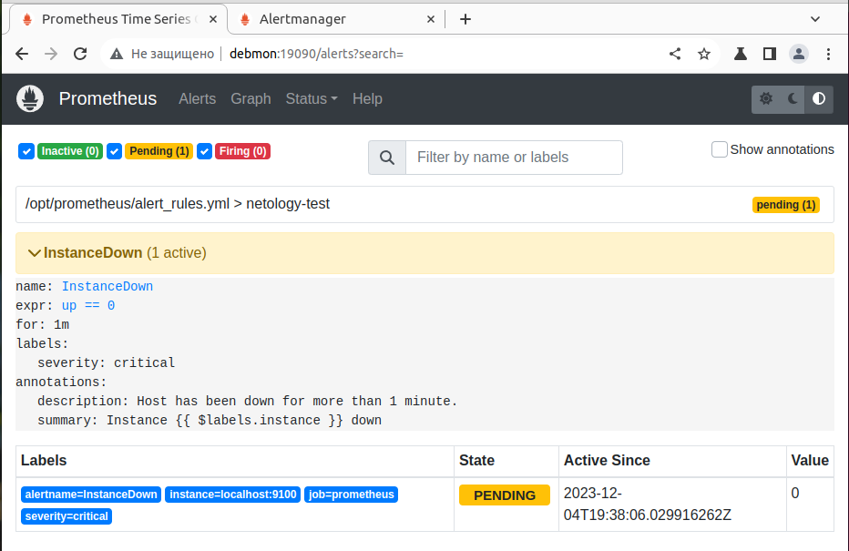
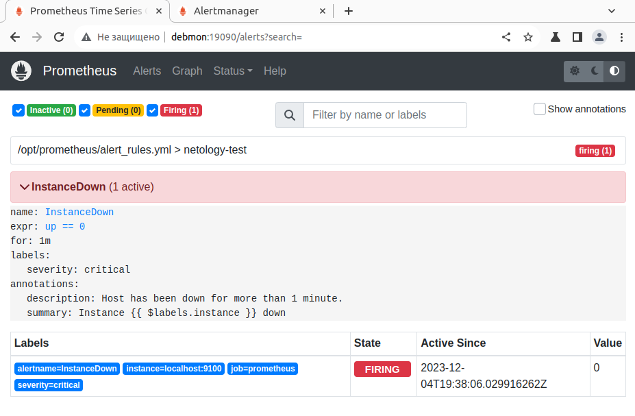
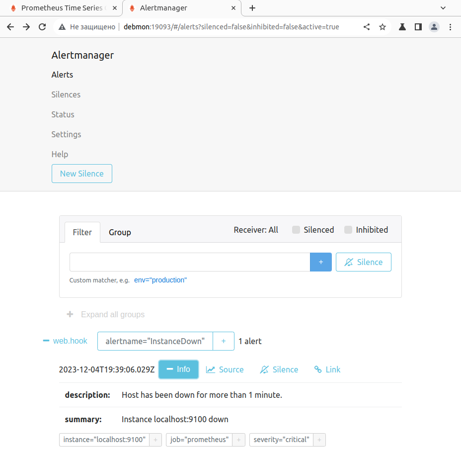
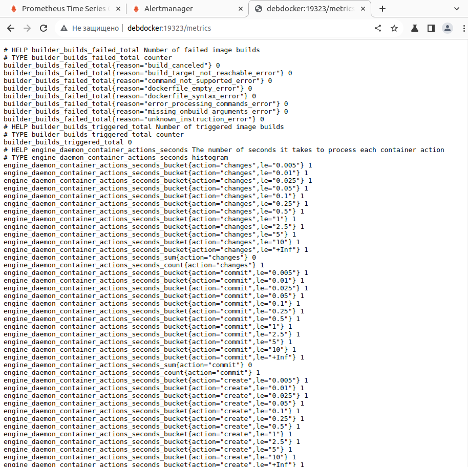
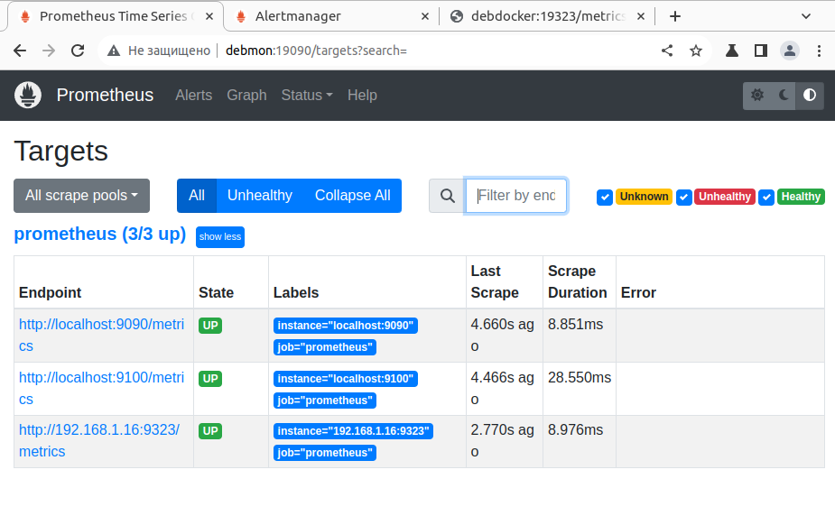

# Домашнее задание к занятию "`Prometheus. Часть 2`" - `Аблогин Павел`

### Задание 1

1. `Создал файл с правилом оповещения, добавил его в конфиг Prometheus.`
2. `Для проверки отключил node exporter, стоящий на мониторинге, прикрепил скриншот раздела оповещений Prometheus, где оповещение в статусе Pending`

`Скриншоты выполнения задания 1`

---

### Задание 2

1. `Установил Alertmanager и интегрировал его с Prometheus.`
2. `Прикрепите скриншот Alerts из Prometheus, где правило оповещения в статусе Fireing, и скриншот из Alertmanager, где видно действующее правило оповещения`

`Скриншоты выполнения задания 2`

---

### Задание 3

1. `Активировал экспортёр метрик в Docker и подключил его к Prometheus.`
2. `приложил скриншот браузера с открытым эндпоинтом и скриншот списка таргетов из интерфейса Prometheus.`

`Скриншоты выполнения задания 3`

---
